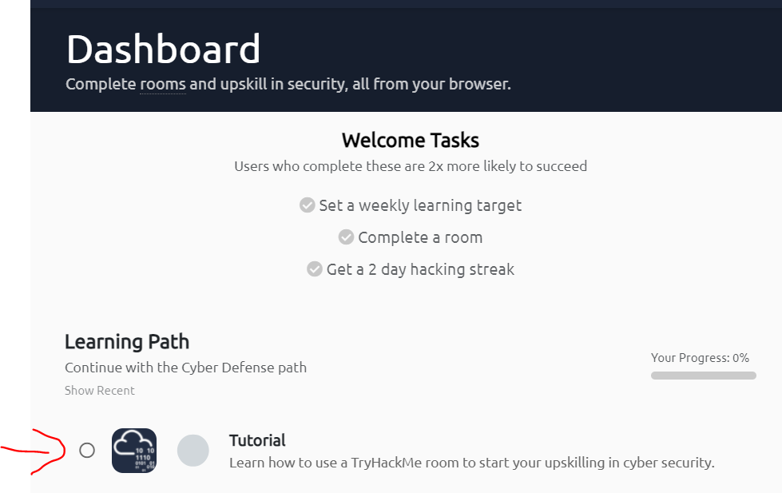
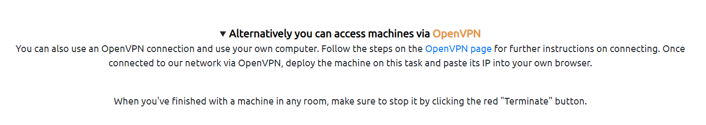
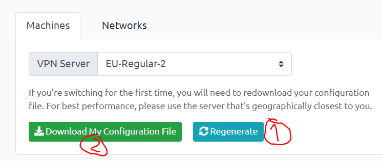

# TryHackMe - OpenVpn

1)  Se créer un compte sur [https://tryhackme.com/](https://tryhackme.com/)

2) Suivre le tutoriel sur tryHackMe



2) En bas du tutoriel, choisir OpenVPN




3) Générer le fichier openVPN puis le télécharger




4) Si vous êtes sur Linux

Après avoir installé open vpn, lancer le fichier VPN

```bash
openvpn Carcajou.ovpn
```

